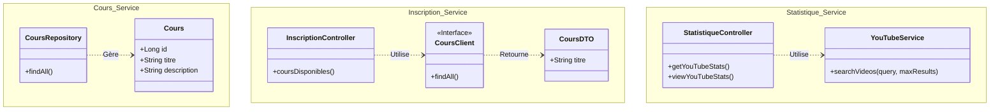

# Online Learning Platform V2 - Microservices

Ce projet est une plateforme d'apprentissage en ligne basée sur une architecture microservices avec Spring Boot et Spring Cloud.

## 🏗️ Architecture & Ports

Voici un schéma global de l'architecture avec les ports utilisés par chaque service.

```mermaid
graph TD
    User((Utilisateur))
    
    subgraph Infrastructure
        Eureka[Eureka Server<br/>Port: 8761]
    end
    
    subgraph Microservices
        Cours[Cours Service<br/>Port: 8081<br/>(H2 DB)]
        Inscription[Inscription Service<br/>Port: 8082]
        Stats[Statistique Service<br/>Port: 8083]
    end
    
    subgraph External
        YouTube[YouTube API]
    end

    %% Connexions
    Cours -->|Enregistrement| Eureka
    Inscription -->|Enregistrement| Eureka
    Stats -->|Enregistrement| Eureka
    
    Inscription -->|Feign Client /cours| Cours
    Stats -->|WebClient| YouTube
    
    User -->|HTTP| Inscription
    User -->|HTTP| Stats
    User -->|HTTP| Cours
```

## 🧩 Diagramme de Classes / Composants

Ce diagramme montre les principaux composants et entités de chaque microservice.



## 🚀 Liens de Test Rapides

Copiez-collez ces liens pour tester vos services.

### 1. Eureka Server (Tableau de bord)
*   **URL :** `http://localhost:8761`
*   **But :** Vérifier que tous les services (`COURS-SERVICE`, `INSCRIPTION-SERVICE`, `STATISTIQUE-SERVICE`) sont bien enregistrés (UP).

### 2. Cours Service (Backend Données)
*   **Liste des cours (JSON) :** `http://localhost:8081/cours`
*   **But :** Voir les données brutes stockées dans la base H2.

### 3. Inscription Service (Consommateur)
*   **Cours disponibles (via Feign) :** `http://localhost:8082/cours-disponibles`
*   **But :** Vérifier que le service Inscription arrive bien à discuter avec le service Cours.

### 4. Statistique Service (YouTube API)
*   **Recherche JSON (Données brutes) :**
    `http://localhost:8083/stats/youtube?query=Java`
    
*   **Recherche Visuelle (Lecteur Vidéo) - 10 résultats :**
    `http://localhost:8083/stats/youtube/view?query=Java`
    
*   **Recherche Visuelle - 20 résultats :**
    `http://localhost:8083/stats/youtube/view?query=Spring+Boot&maxResults=20`

## 📝 Commandes Utiles

**Lordre de démarrage recommandé :**
1.  `EurekaServerApplication`
2.  `CoursServiceApplication`
3.  `InscriptionServiceApplication`
4.  `StatistiqueServiceApplication`
